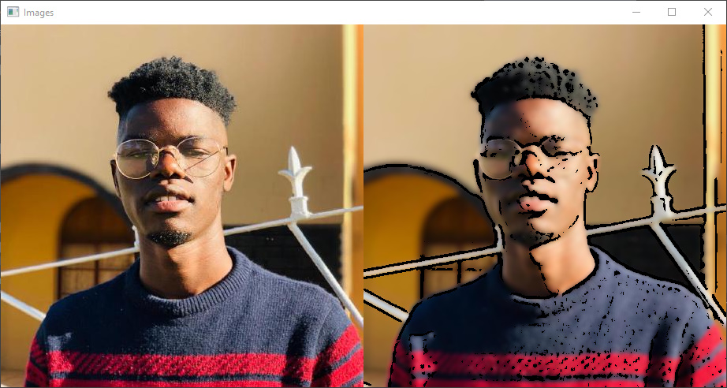

### Cartoonfying Images

In this one we are going to use `opencv` to catonify images.


```python
import cv2
import numpy as np

image = cv2.imread('me.jpg')
gray = cv2.cvtColor(image, cv2.COLOR_BGR2GRAY)
gray = cv2.medianBlur(gray, 5)
edges = cv2.adaptiveThreshold(gray, 255, cv2.ADAPTIVE_THRESH_MEAN_C, cv2.THRESH_BINARY, 9, 9)
color = cv2.bilateralFilter(image, 9, 250, 250)
cartoon = cv2.bitwise_and(color, color, mask=edges)

images = np.hstack([image, cartoon])
cv2.imshow("Images", images)
cv2.waitKey(0)
cv2.destroyAllWindows()
```


Output:

